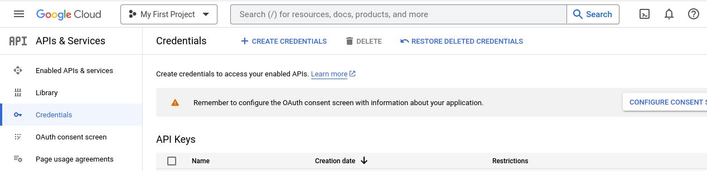

# Google Oauth
Sample dilakukan dengan bahasa pemrograman Go.
Sebelum masuk masuk ke koding, kita perlu membuat credentials Oauth di console Google Cloud.

## Membuat Credentials Oauth
Pertama, kunjungi <a href="https://console.cloud.google.com/apis/credentials">Google Cloud Console</a>.
Setelah itu klik <b>CREATE CREDENTIALS</b> pada navbar atas dan pilih <b>OAuth client ID</b>.

