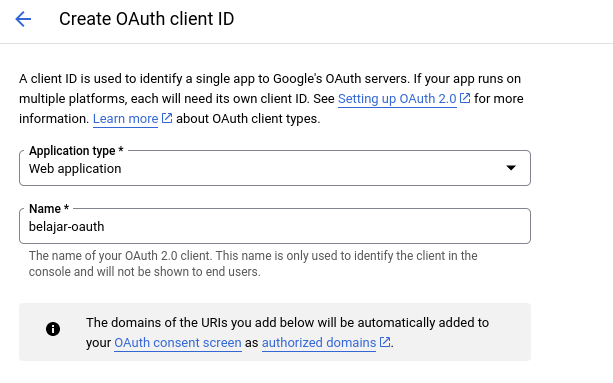
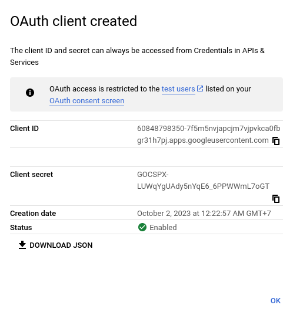

# Google Oauth
Sample dilakukan dengan bahasa pemrograman Go.
Sebelum masuk masuk ke koding, kita perlu membuat credentials Oauth di console Google Cloud.

## Membuat Credentials Oauth

Pertama-tama, kunjungi <a href="https://console.cloud.google.com/apis/credentials">Google Cloud Console</a>.
Setelah itu klik <b>CREATE CREDENTIALS</b> pada navbar atas dan pilih <b>OAuth client ID</b>.

Setelah itu pada pilihan <b>Application type</b> pilih <b>Web Application</b>.
Pada field <b>Name</b> silahkan diisi dengan nama credentials. 
Nama ini sebagai identitas yang akan memudahkan kita dalam mengelola credentials Oauth.

Pada section Authorized Javascript origins. Tambahkan URL server dengan menekan tombol <b>Add URIs</b>.
Di sini akan kita isi dengan <b>http://localhost:8080</b>. Lanjut di bagian Authorized <b>Redirect URIs</b> silahkan diisi dengan URL yang akan digunakan untuk redirect ke halaman Google di sini contohnya <b>http://localhost:8080/auth/google/callback</b>. Jika sudah, kita bisa simpan dengan menekan tombol <b>Create</b>

Setelah itu, akan ada popup yang menampilkan Client ID beserta secret milik kita. Silahkan copy masing-masing Client ID dan secret

Sampai di tahap ini, pembuatan credentials Oauth sudah selesai.

