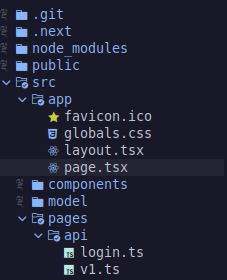

# Next JS API Routes
Ini adalah contoh minimal / simple untuk membuat routes API di NextJS.

# Struktur Folder

Seperti biasa init folder NextJS. Lalu buat folder pages/api. Berikut contohnya

Berdasarkan struktur folder di atas, akan menghasilkan url berikut http://localhost:3000/api/login dan http://localhost:3000/api/v1

# Handler 
